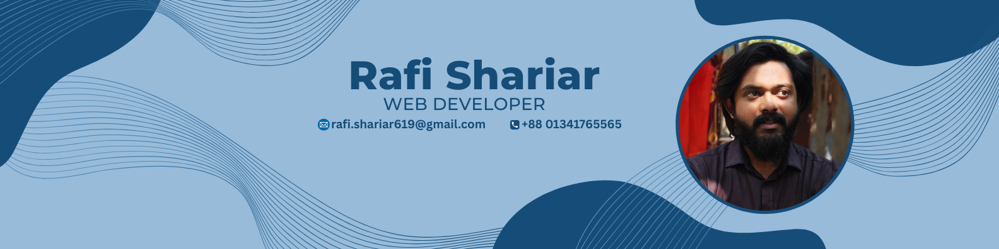

  

<h1 align="center">Rafi Shariar</h1>
<h3 align="center">MERN Stack Developer</h3>

# 💫 About Me:
Hi, I'm Rafi Shariar, a 3rd-year Computer Science & Engineering student at Daffodil International University. I'm a passionate Full Stack Web Developer with hands-on experience in technologies like HTML, CSS, JavaScript, Tailwind CSS, Firebase, Node.js, Express.js, MongoDB, and React.  Beyond web development, I have a solid foundation in C++, Data Structures & Algorithms, Object-Oriented Programming (OOP), and System Design. I enjoy building interactive, functional, and user-friendly web applications that solve real-life problems and add value to people's lives.  

## 📞 Contact

# 💻 Tech Stack:
                
# 📊 GitHub Stats:
 
 

## 🏆 GitHub Trophies

### 🔝 Top Contributed Repo

<!-- Proudly created with GPRM ( https://gprm.itsvg.in ) -->
