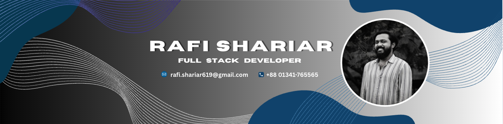

  

<h1 align="">Hi there, I'm Rafi Shariar</h1>

I am a passionate **Full Stack Web Developer** who thrives on building interactive, functional, and user-friendly web applications that solve real-life problems and deliver genuine value to people's lives. With hands-on experience spanning modern web technologies like **React, Next.js, TypeScript, Node.js, Express.js, MongoDB, and PostgreSQL**, I enjoy bridging the gap between elegant frontend interfaces and robust backend architectures. 

Beyond core web development, I hold a deep appreciation for foundational computer science principles. I have established a solid grounding in **C++, Data Structures & Algorithms (DSA), Object-Oriented Programming (OOP), and System Design**. Driven by a love for engineering logic and critical thinking, I have **solved over 500 problems** across various platforms.    I am constantly expanding my technical horizon and am currently **deep-diving into Next.js** to master advanced full-stack systems and performance-optimized architectures.
 

## 📞 Let’s Connect to build something beautiful today.

  

<!-- Proudly created with GPRM ( https://gprm.itsvg.in ) -->
## 💻 Technical Skills & Tools I Work With

<table>
  <!-- Frontend Row -->
  <tr>
    <td align="left" width="15%"><strong>Frontend</strong></td>
    <td align="left">
      
    </td>
  </tr>
  <!-- Backend Row -->
  <tr>
    <td align="left"><strong>Backend</strong></td>
    <td align="left">
      
    </td>
  </tr>
  <!-- Databases Row -->
  <tr>
    <td align="left"><strong>Databases</strong></td>
    <td align="left">
      
    </td>
  </tr>
  <!-- Tools Row -->
  <tr>
    <td align="left"><strong>Tools</strong></td>
    <td align="left">
      
    </td>
  </tr>
  <!-- Others Row -->
  <tr>
    <td align="left"><strong>Others</strong></td>
    <td align="left" valign="middle">
      
    
  
  </tr>
</table>

  <!-- GitHub Streak Counter -->
  

